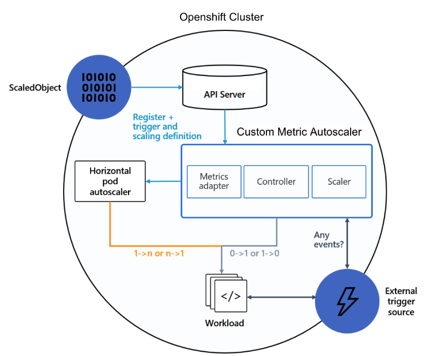

# Customer Metrics Autoscaler
## Introduction
The Custom Metrics Autoscaler operator is derived from the KEDA upstream project. This autoscaler principally aims to simplify autoscaling based on events and custom metrics for users. While acting as layer on top of the Horizontal Pod Autoscaler, it enables fine-grained autoscaling for event-driven Kubernetes workloads by allowing users to define autoscaling rules. Also the Custom Metrics Autoscaler supports scaling to and from zero.

## Architecture

The Custom Metrics Autoscaler is made up of the Controller and the Metrics Server:

* The Controller, continuously observes configured ScaledObject resources, orchestrating the dynamic scaling of workloads based on the defined metric triggers and criteria, ensuring optimal resource allocation and management in Kubernetes environments.
    * ScaledObject specify the metrics and triggers to be monitored, enabling the controller to efficiently manage the scaling of workloads in response to metric fluctuations or event sources, enhancing application performance and resource utilization.
    * TriggerAuthentication custom resources are utilized to manage authentication information for scaling triggers securely. It centralizes credential management, providing a unified approach to authenticate with external systems, ensuring secure and efficient autoscaling while mitigating the need to store sensitive authentication data within component configurations.

* The Metrics Server acts as an interface, connecting OpenShift’s API server with external metrics, which are provided to the Horizontal Pod Autoscaler Controller, facilitating the under-the-hood, event-driven autoscaling of workloads, ensuring efficient resource utilization and management.
